# AutoMakerOS

AutoMakerOS is the open-source software suite used to drive **Robox** 3D printers, originally developed by **C Enterprise (UK) Ltd (CEL-UK)**. This repository combines the individual Robox software components into a single tree:

| Module | Purpose |
|---|---|
| [Configuration](Configuration) | XML-based configuration loading library used by all other modules. |
| [Stenographer](Stenographer) | Shared logging library. |
| [Language](Language) | Internationalisation / translation resources. |
| [RoboxBase](RoboxBase) | Core logic for talking to Robox printers (communication protocol, printer/head/filament models, slicing, etc). |
| [CelTechCore](CelTechCore) | JavaFX front-end components shared by AutoMaker. |
| [AutoMaker](AutoMaker) | The main desktop application used to control a Robox printer: load/slice/preview/print 3D models. |
| [GCodeViewer](GCodeViewer) | Standalone GCode previewer, also used by AutoMaker to preview sliced models. |
| [RoboxRoot](RoboxRoot) | "Root" — a DropWizard-based HTTP server, normally run on a Raspberry Pi, for remotely controlling a Robox printer over the network. |
| [GRoot](GRoot) | JavaFX touchscreen GUI client for Root (used on the Raspberry Pi's attached touchscreen). |
| [Installer](Installer) | Resources (icons, install scripts, EULA, etc.) used to package the applications above into installers. |

## About the application

AutoMaker is a desktop application (Windows / macOS / Linux, built with Java and JavaFX) that lets you prepare and send 3D models to a Robox printer: it imports models, slices them into GCode, previews the result, and manages printing, calibration and printer/filament/head settings. Root and GRoot extend this to a network-attached Raspberry Pi that can host the printer connection and be controlled remotely (e.g. via a touchscreen or a browser).

## Screenshots

<!-- GitHub's Markdown renderer strips JavaScript, so there's no real slider — this table is wider than the page and scrolls horizontally instead, giving a carousel-like filmstrip. Click any image to view it full size. -->
<p align="center"><i>Scroll sideways to see more &rarr;</i></p>

<table>
<tr>
<td align="center" width="260"><a href="Screenshots/RoboxAutoMaker.png">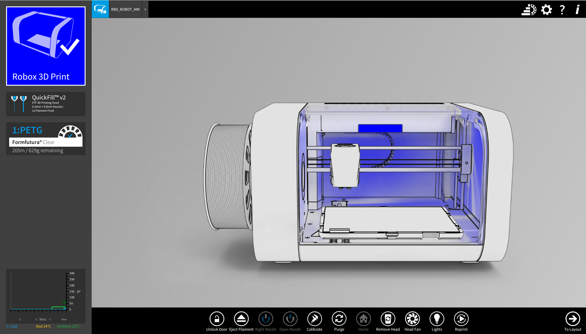</a><br><sub>Main window</sub></td>
<td align="center" width="260"><a href="Screenshots/ModelView.png">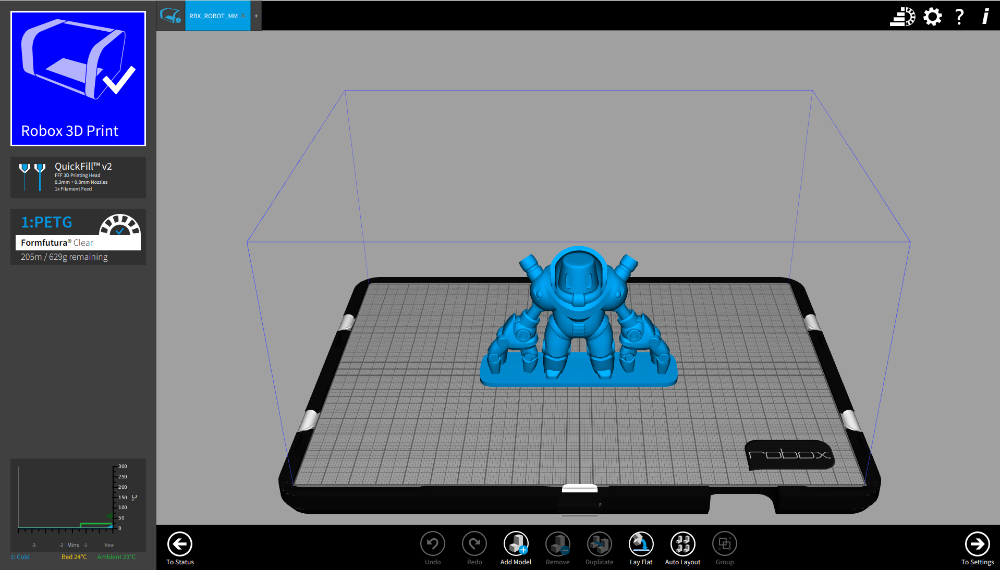</a><br><sub>Model / build view</sub></td>
<td align="center" width="260"><a href="Screenshots/LibraryFilaments.png">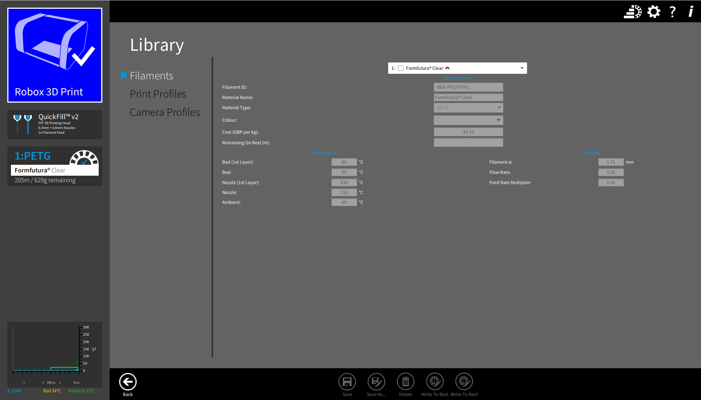</a><br><sub>Filament library</sub></td>
<td align="center" width="260"><a href="Screenshots/LibraryPrintProfiles.png">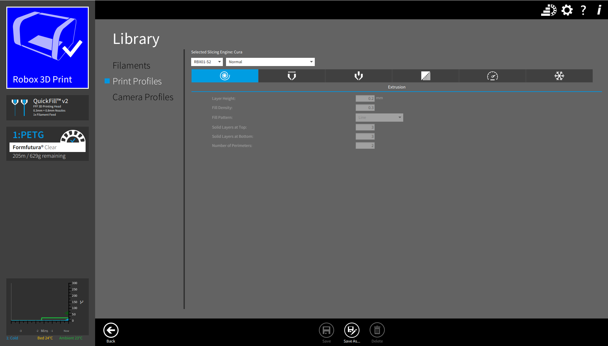</a><br><sub>Print profile library</sub></td>
<td align="center" width="260"><a href="Screenshots/LibraryCameraProfiles.png">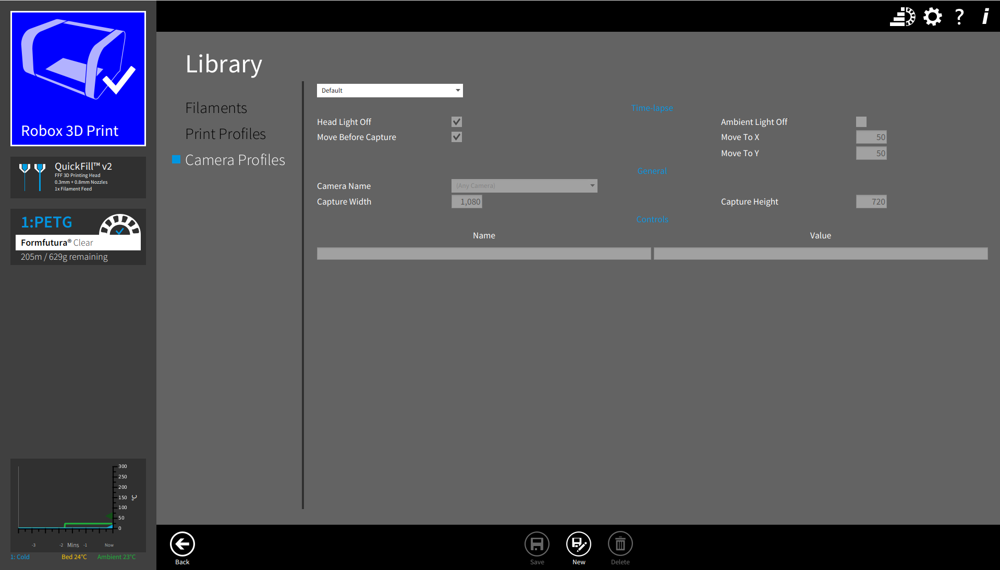</a><br><sub>Camera profile library</sub></td>
<td align="center" width="260"><a href="Screenshots/PreferencesPrinting.png">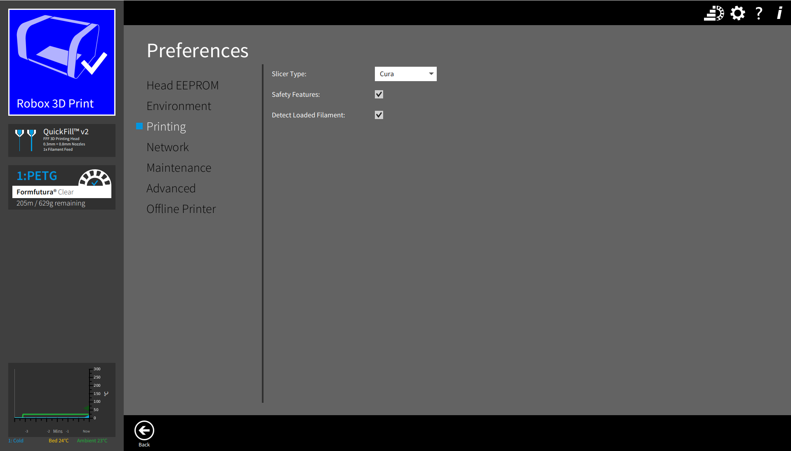</a><br><sub>Preferences – Printing</sub></td>
<td align="center" width="260"><a href="Screenshots/PreferencesAdvanced.png">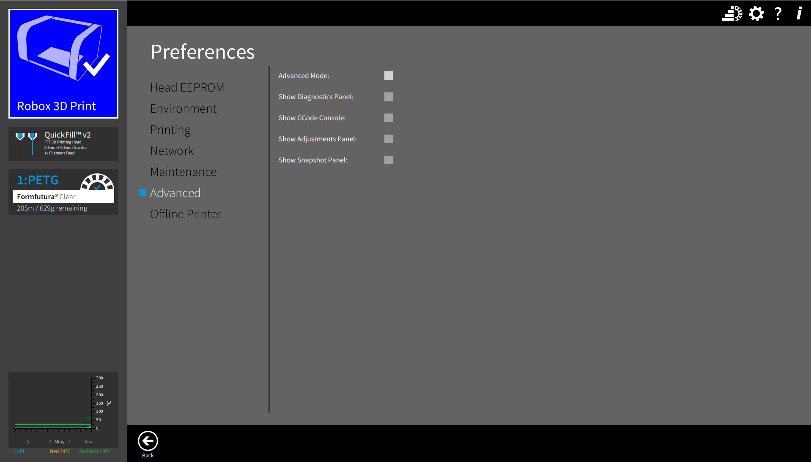</a><br><sub>Preferences – Advanced</sub></td>
<td align="center" width="260"><a href="Screenshots/PreferencesEnvironment.png">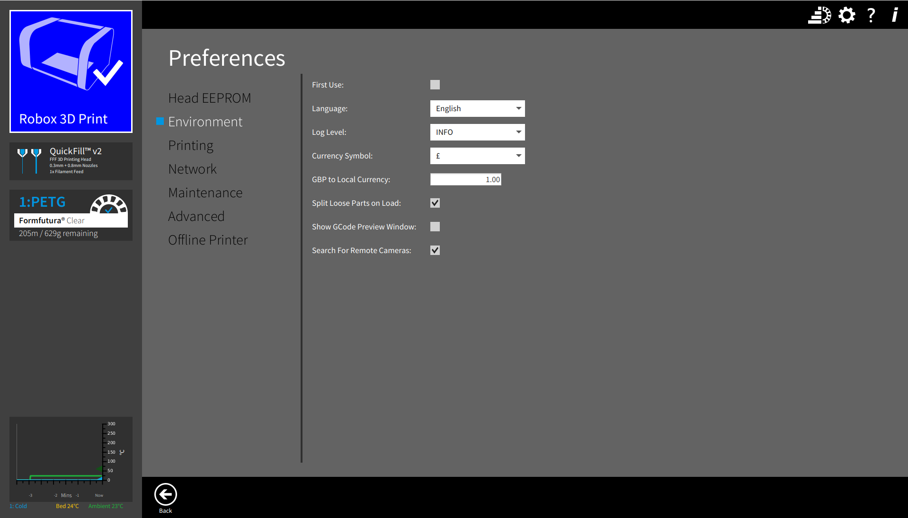</a><br><sub>Preferences – Environment</sub></td>
<td align="center" width="260"><a href="Screenshots/PreferencesNetwork.png">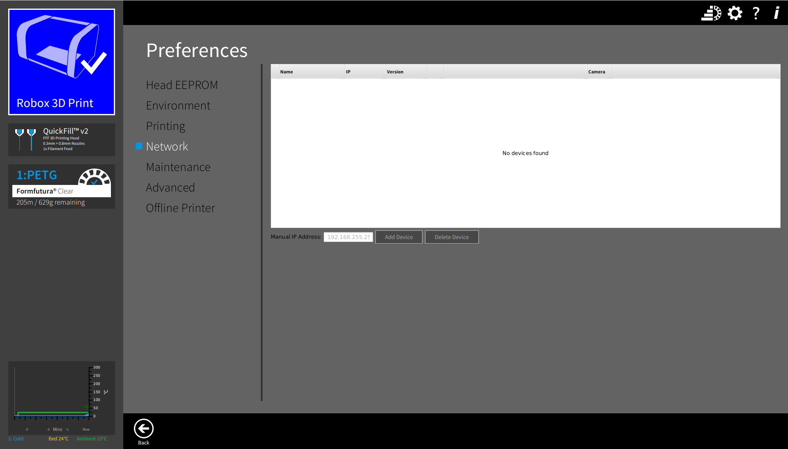</a><br><sub>Preferences – Network</sub></td>
<td align="center" width="260"><a href="Screenshots/PreferencesOfflinePrinter.png">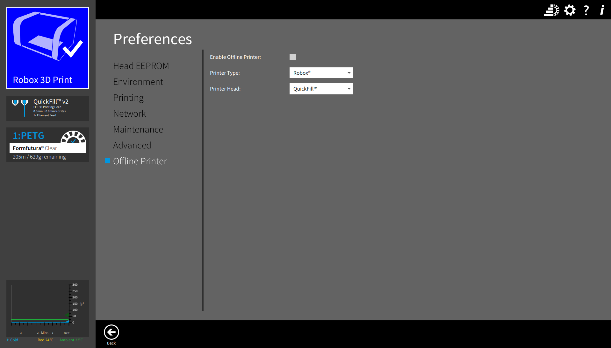</a><br><sub>Preferences – Offline printer</sub></td>
<td align="center" width="260"><a href="Screenshots/PreferencesMaintenance.png">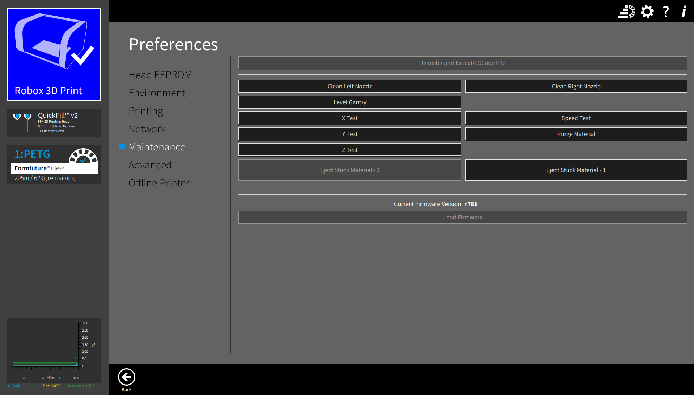</a><br><sub>Preferences – Maintenance</sub></td>
<td align="center" width="260"><a href="Screenshots/PreferencesHeadEEPROM.png">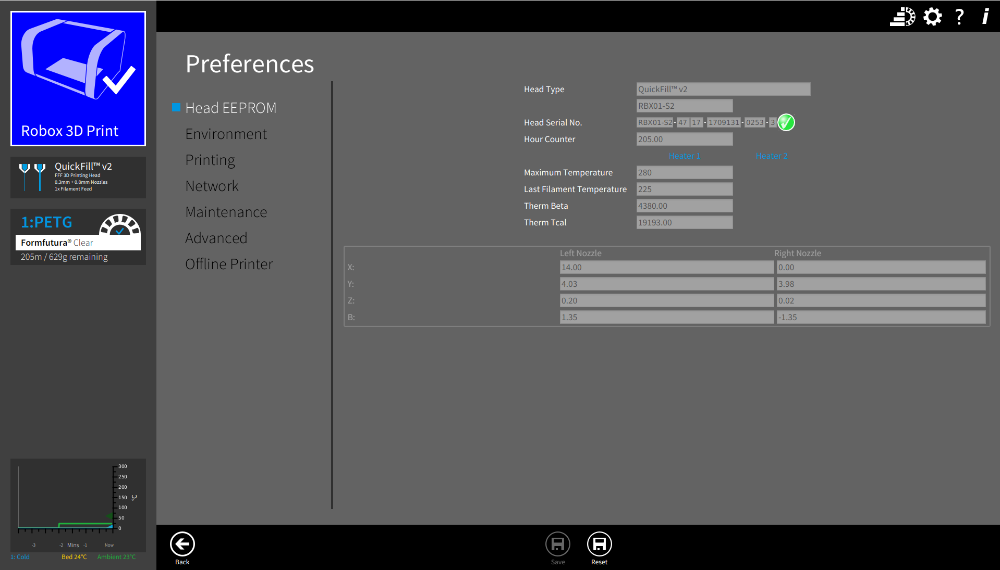</a><br><sub>Preferences – Head EEPROM</sub></td>
</tr>
</table>

## History, provenance and licence

This software was originally created by CEL-UK (C Enterprise (UK) Ltd) to support their Robox 3D printer range, and was later released as open source.

- **Original manufacturer website:** https://www.cel-robox.com — this site is **no longer working/online**.
- **Cloned from:** https://github.com/celsworthy/AutoMakerOS, itself an aggregation of the individual open-sourced CEL-UK repositories (`Configuration`, `Stenographer`, `Language`, `RoboxBase`, `CELTechCore`, `AutoMaker`, `RoboxRoot`, `GRoot`, `GCodeViewer`, `Installer`, etc.), maintained by GitHub user [**celsworthy**](https://github.com/celsworthy).
- **Licence:** [GNU General Public License v3.0 (GPLv3)](LICENSE). You are free to use, study, modify and redistribute this software under the terms of that licence.

### Previous authors

Based on the `@author` tags left in the original source code, the software was written and maintained by (at least):

- Ian Hudson
- George Salter
- Tony Aldhous
- Andy Till
- Moises Baly
- Jim Moore

...working at **C Enterprise (UK) Ltd** / **Liberty Systems Limited**, with further open-sourcing and maintenance work by [celsworthy](https://github.com/celsworthy). This list is derived from source code comments and may not be exhaustive; if you know of other contributors, please add them.

## Requirements

- **JDK 11.0.2 or later, bundled with a matching version of JavaFX** (the stock OpenJDK builds on most Linux distributions do **not** include JavaFX). A build such as [BellSoft Liberica JDK "Full" 11.0.2+](https://bell-sw.com/pages/downloads/) is known to work.
- [Apache Maven](https://maven.apache.org/download.cgi) (or the NetBeans IDE, which bundles Maven support).
- A Robox 3D printer connected via USB, if you want to actually print.

## Compiling

Clone this repository, then build the modules **in the following order** (each depends on the ones before it):

```
Configuration
Stenographer
Language
RoboxBase
CelTechCore
AutoMaker
RoboxRoot
GRoot
GCodeViewer
```

For each module, build with Maven:

```bash
cd <module directory containing pom.xml>
mvn clean install
```

This installs each built jar into your local Maven repository (`~/.m2`) so that the next module in the list can find it as a dependency, and also leaves the built jar under that module's `target/` directory.

Alternatively, each module can be imported into NetBeans as a project; set every project's compile Java Platform to the same JDK (see Requirements above), then clean-and-build each one in the order above.

## Running on Linux (any distribution), Windows and macOS

AutoMaker and the other applications are plain Java/JavaFX applications, so they are not tied to any particular Linux distribution — anything with a compatible JDK will work (this has been adapted to run outside of a CEL-supplied installer/Debian package).

1. Make sure the JDK described in Requirements is on your `PATH` (or set `JAVA_HOME`).
2. Each application needs to be told where its configuration file is, via the `libertySystems.configFile` system property, e.g. for AutoMaker:

   ```bash
   java -DlibertySystems.configFile=AutoMaker/AutoMaker.linux.configFile.xml -jar AutoMaker/target/AutoMaker.jar
   ```

   Use `AutoMaker.linux.configFile.xml` on Linux/macOS and `AutoMaker.configFile.xml` on Windows. Similar `*.configFile.xml` files exist alongside `RoboxRoot.jar` and `GCodeViewer.jar`.
3. The config file's `FakeInstallDirectory` entry tells the app where to find its resources (icons, language files, EULA, etc). On Linux it is set to `$USER_HOME$/3dPrinter/application/AutoMakerOS/Installer/AutoMaker/`, where `$USER_HOME$` is automatically resolved to the current user's home directory (see [Configuration.java](Configuration/src/main/java/libertysystems/configuration/Configuration.java)) — so no per-user editing is required as long as the repository lives at that path under your home directory. If you clone the repository somewhere else, update that entry (or the equivalent one in the Windows/macOS config files) to point at your `Installer/AutoMaker` (or `Installer/Root`) directory.
4. **USB access on Linux:** to let a non-root user access the printer's USB serial port, install the udev rule from [Installer/robox.rules.linux](Installer/robox.rules.linux), e.g.:

   ```bash
   sudo cp Installer/robox.rules.linux /etc/udev/rules.d/99-robox.rules
   sudo udevadm control --reload-rules && sudo udevadm trigger
   ```

   You will also usually need to be a member of the `dialout` (or equivalent) group.
5. Root/GRoot were originally designed to run on a Raspberry Pi, but are ordinary JavaFX/DropWizard applications and can be run on any Linux, Windows or macOS machine — see [DEVELOPER_NOTES.md](DEVELOPER_NOTES.md) for the Raspberry Pi–specific setup (systemd services, touchscreen calibration, etc), which is optional if you only want to run Root/GRoot on a desktop OS.

macOS should work the same way as Linux (JavaFX build + `libertySystems.configFile` pointed at a mac-appropriate config), though it has had less recent testing than Linux/Windows.

### AppImage (Linux)

For a distro-independent way to run AutoMaker on Linux without wrangling JDK/JavaFX versions by hand, [Installer/AutoMaker/AppImage/build-appimage.sh](Installer/AutoMaker/AppImage/build-appimage.sh) packages a built AutoMaker, a matching JavaFX runtime, a minimal bundled JRE (built with `jlink`, no system Java required to *run* it) and its resource files into a single self-contained `AutoMaker-<version>-x86_64.AppImage`.

To build it, after building AutoMaker itself (see Compiling above):

```bash
Installer/AutoMaker/AppImage/build-appimage.sh
```

This needs `jlink` (part of any JDK) and [appimagetool](https://github.com/AppImage/AppImageKit/releases) (on `$PATH`, or pointed to via `$APPIMAGETOOL`). The resulting AppImage is written to `dist/`; run it directly, e.g.:

```bash
chmod +x dist/AutoMaker-*.AppImage
dist/AutoMaker-*.AppImage
```

## Using AutoMaker

1. Launch AutoMaker as shown above, or via the AppImage (see above), or via a proper install once packaged (see [DEVELOPER_NOTES.md](DEVELOPER_NOTES.md) for the historical installer process).
2. Connect a Robox printer over USB (or a Root-connected printer over the network); AutoMaker will detect and let you select it.
3. Load a 3D model (e.g. STL) into the workspace, position/scale/rotate it as needed.
4. Choose print settings (material, quality, support, etc.) and slice the model; the result can be previewed with the built-in GCode viewer before printing.
5. Send the job to the printer to print, and monitor/calibrate the printer from the same interface.

GCodeViewer can also be run standalone to inspect any GCode file — see [GCodeViewer/ReadMe.md](GCodeViewer/ReadMe.md) for its command-line options.

## Further documentation

- [DEVELOPER_NOTES.md](DEVELOPER_NOTES.md) — original CEL-UK engineering notes: installer process, Raspberry Pi ("Root") provisioning and systemd services, Wi-Fi setup, update mechanism, hardware notes, etc. Some of it references CEL-internal infrastructure that is no longer reachable, but it remains useful technical background.
- Per-module `README.md`/`ReadMe.md` files (e.g. [AutoMaker/README.md](AutoMaker/README.md), [GCodeViewer/ReadMe.md](GCodeViewer/ReadMe.md), [RoboxRoot/Readme.md](RoboxRoot/Readme.md), [GRoot/ReadMe.md](GRoot/ReadMe.md)) — build/run notes specific to each component.

## Thanks

Thanks to the original CEL-UK / C Enterprise (UK) Ltd team for building Robox and this software, and to [celsworthy](https://github.com/celsworthy) for open-sourcing and maintaining it on GitHub after the original CEL website went offline, keeping this software usable for existing Robox owners. Thanks also to everyone who contributed fixes, documentation and testing over the years.
